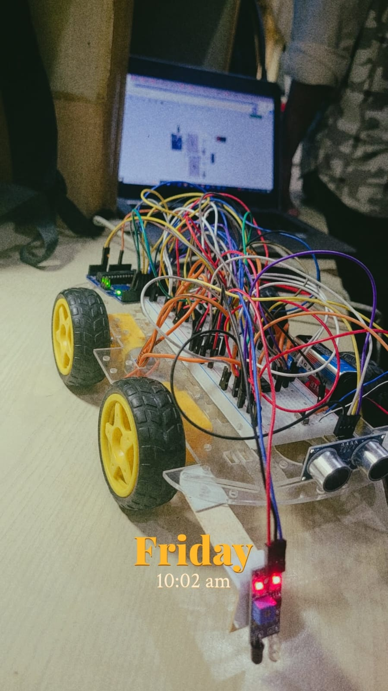
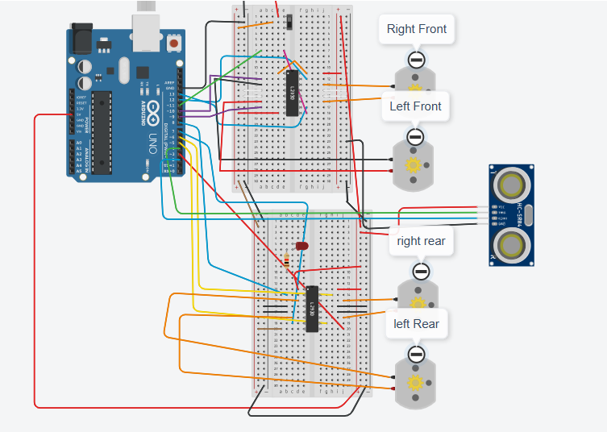

# Arduino-Based Automated Car with Lane Assist

A hardware project built as part of our **Digital Logic Design (DLD)** course at **FAST-NUCES**, designed and developed using **Arduino**, **IR sensors**, **ultrasonic sensors**, and **digital ICs** to simulate lane following and obstacle detection.

## Overview

This project simulates a **lane-assist car** using:

* **IR sensors** for lane detection
* **Ultrasonic sensors** for obstacle avoidance
* **Digital IC logic** to manage control signals
* **Arduino UNO** to process sensor data and drive the motors

The vehicle automatically aligns itself within the lane and stops or reroutes upon detecting an obstacle ahead.

## Components Used

* Arduino Uno
* IR Sensors (TCRT5000)
* Ultrasonic Sensors (HC-SR04)
* Motor Driver (L298N)
* DC Motors
* 9V Battery & Battery Holder
* Breadboard and jumper wires
* ICs for logic-level operations
* Chassis with wheels

## Features

* **Lane Following** using calibrated IR sensors
* **Obstacle Avoidance** using ultrasonic sensors
* **Safe stopping distance** maintained dynamically
* Built-in **collision prevention logic** by setting up distance threshold
* Fully tested on both **simulation and real hardware**

## Development Process

* **Simulation First**: We used Tinkercad for virtual testing.
* **Hardware Prototyping**: Transitioned to real breadboard implementation.
* **Debugging Nightmare**: Faulty sensors and a burnt Arduino due to a wrong pin connection taught us hard lessons.
* **Trial and Error**: Over 15 sensors were tested until we found reliable ones.
* **Teamwork**: Countless overnight sessions, right from coding to soldering.

## Lessons Learned

* Importance of pre-testing components
* Identifying hardware faults vs code bugs
* Efficient power management for continuous testing
* The value of perseverance in real-world hardware projects
* How to collaborate, debug, and stay consistent under pressure

## Sneak Peek

### Circuit Diagram

## Future Improvements

* Add Bluetooth control or IoT functionality
* Speed control via PWM
* LCD display for real-time distance feedback
